# ParkingApp

**This is the fully functional, high optimized, scalable and reliable offline real world parking prototype App.**

## Features
 - Create a Parking system with configurable floor and space 
 - Reserve Vehicle by providing the details and date
 - Cancel reservation before parking date by providing Reservation ticket details
 - Park the vehicle on the reserved slot if already reserved, else based on availability
 - Get Parking ticket on successful parking
 - View complete parking lot status of each floor with parked vehicle details [Space allotted based on vehicle type Bike-40%, Car-40%, Bus-20%]
 - View all transaction summary and vehicle type-based transactions 

## Screens
 - **Parking System creation screen**

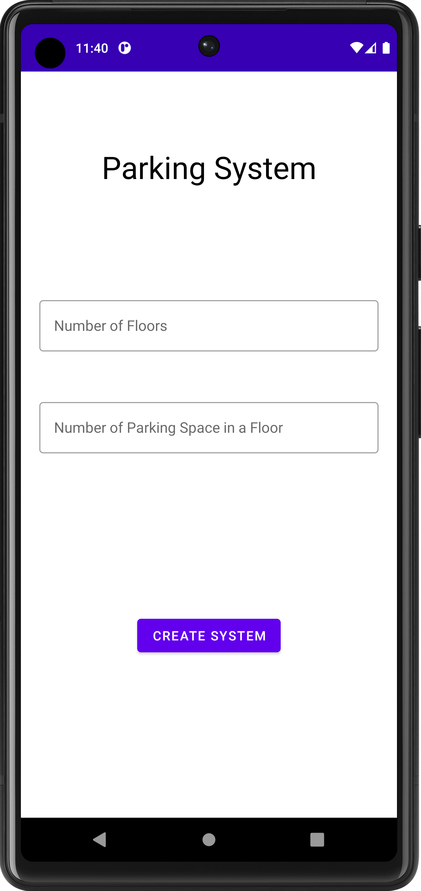

 - **Parking Building view and Reservation screens**

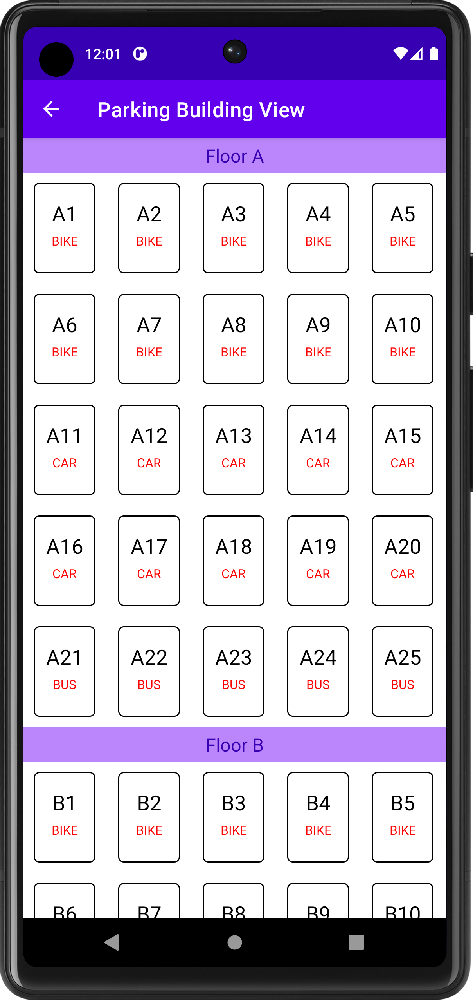 
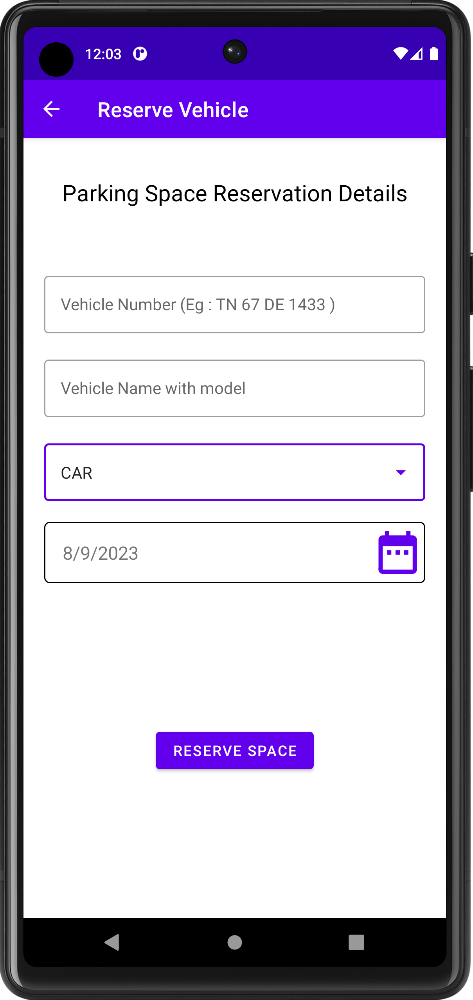 
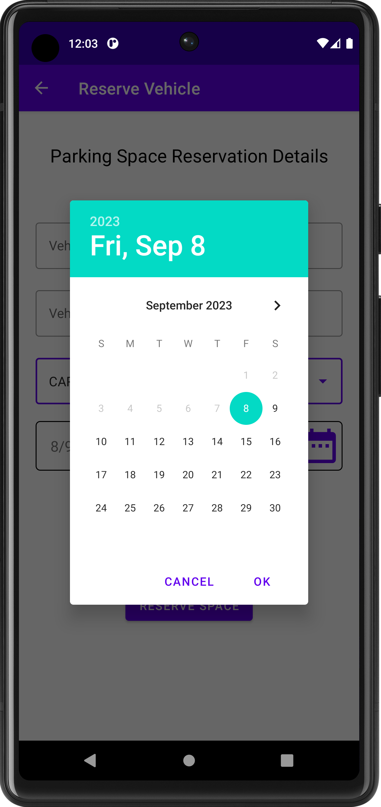 

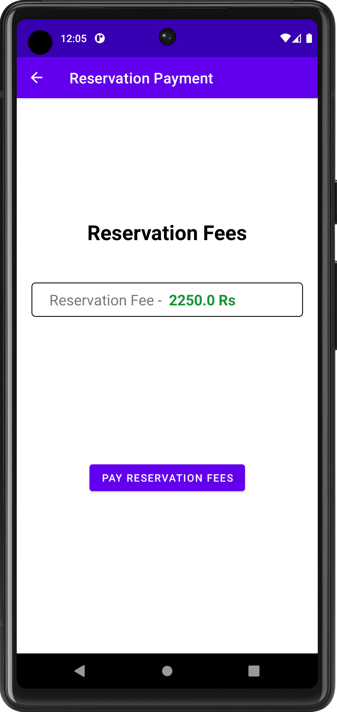 
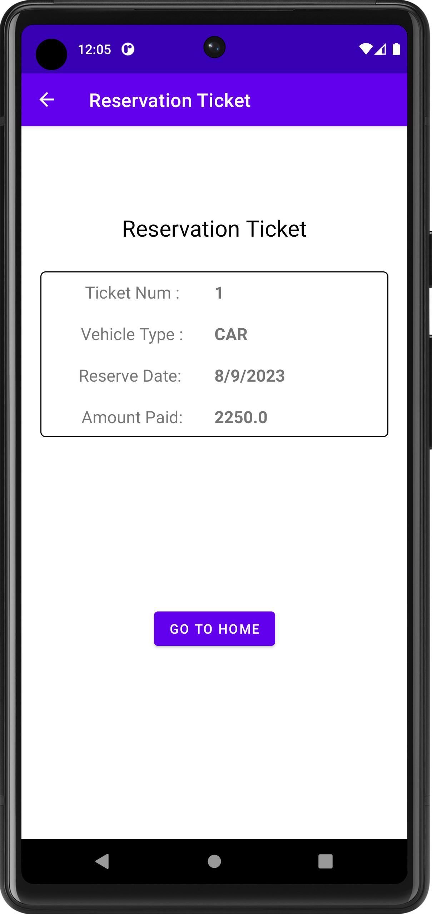 
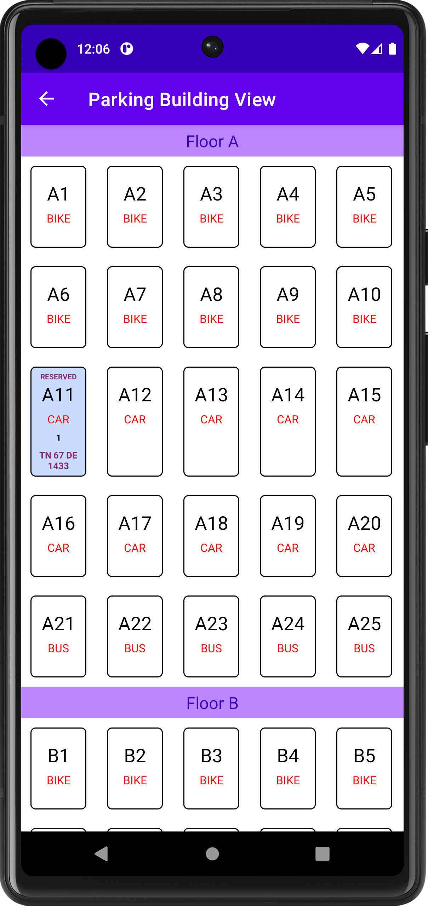 

- **Park vehicle screens**

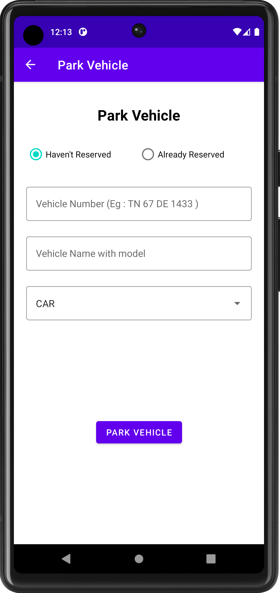 
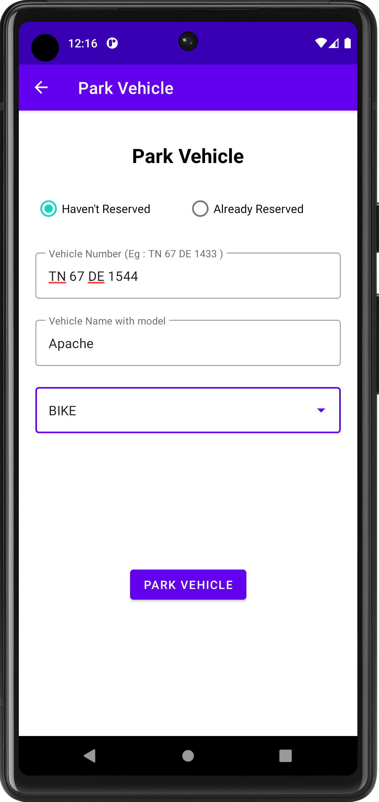 
 

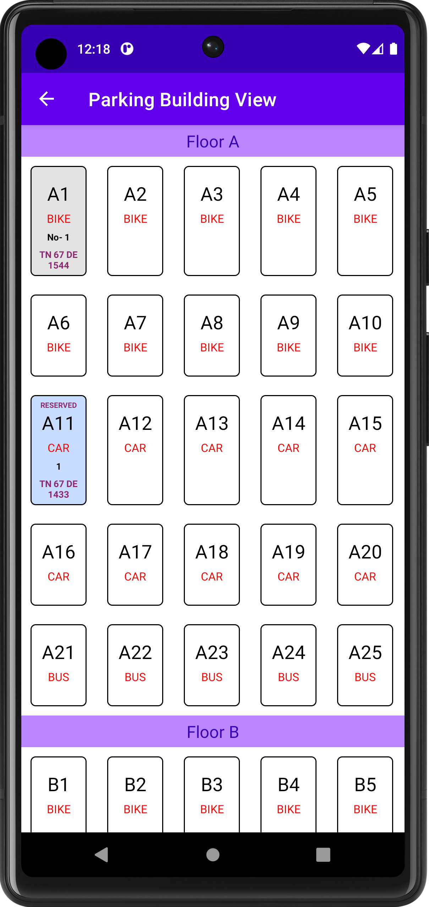

- **Un-park vehicle screens**

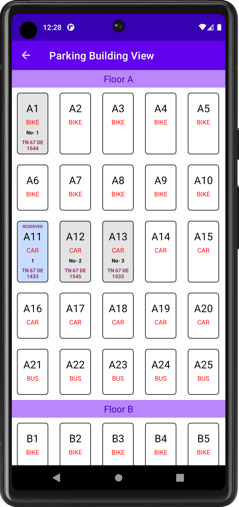 
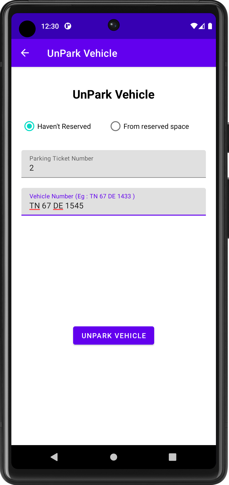 
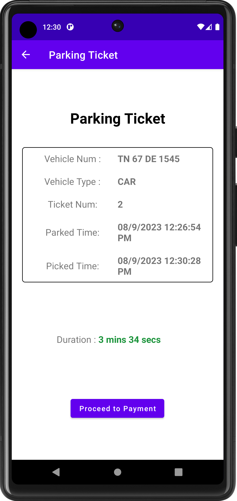 

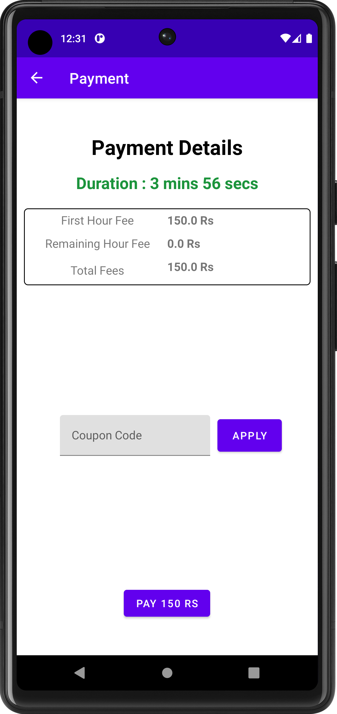
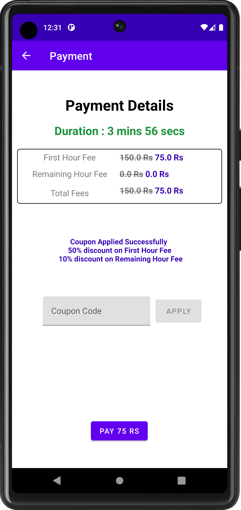
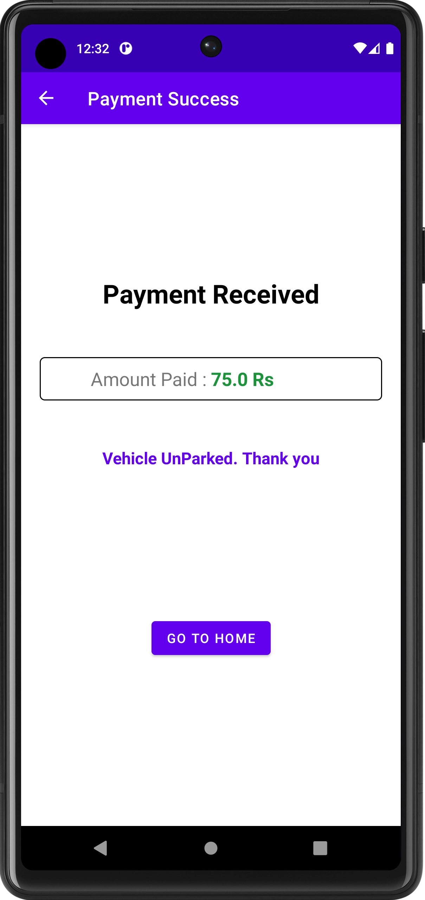
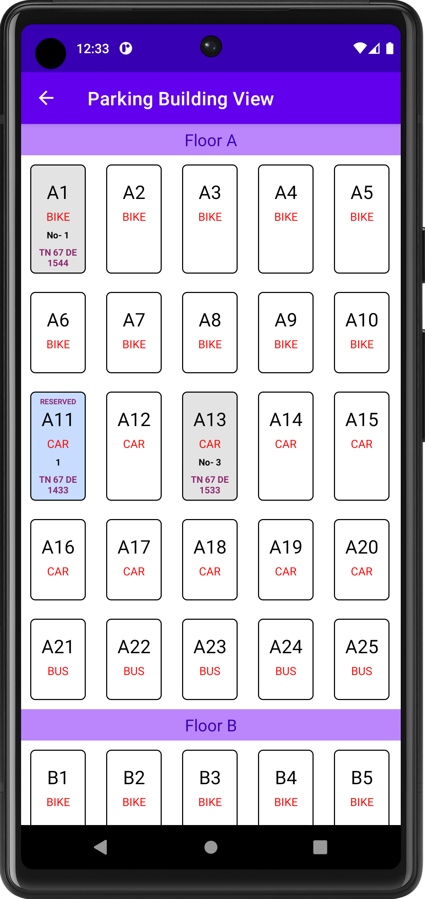

- **Transaction screens**

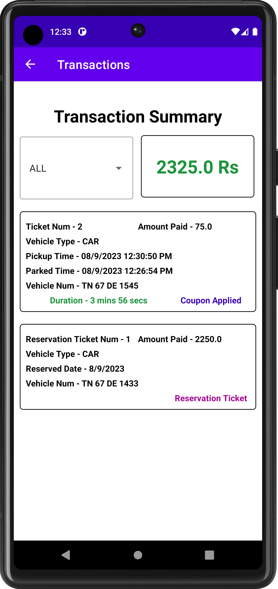 
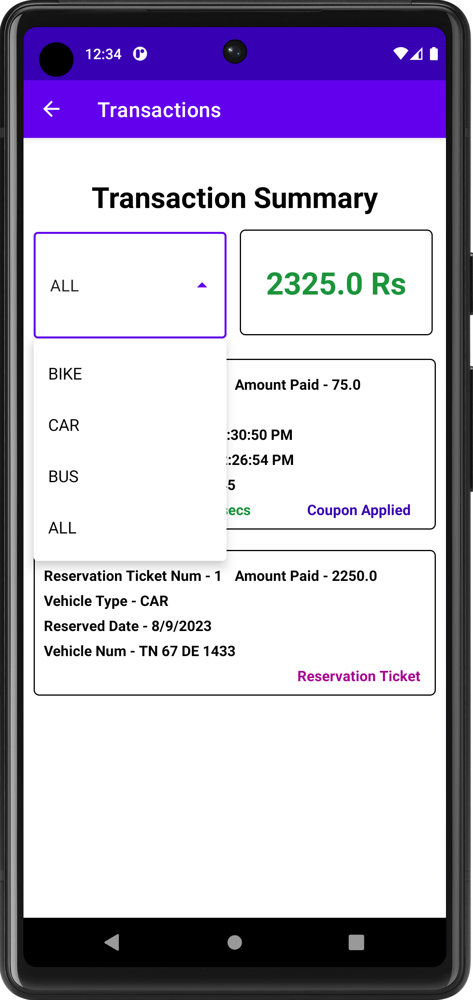 

